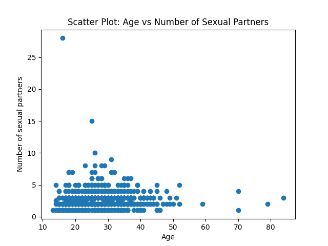
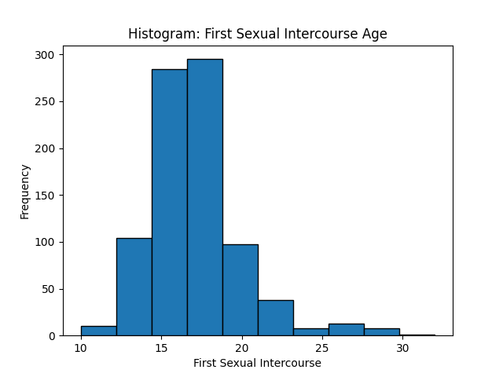
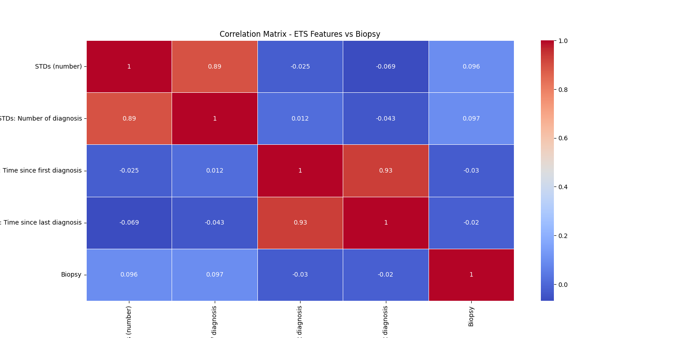

# Proyect analysis of data

<div align="center">

# Cervical Cancer analysis

</div>

<div align ="center">

   

</div>
<br>

This analysis is about findind the relationship between sexual partners and STD´s. We based our proyect on Dr. Milaan Parmar [Cervical Cancer Predection Analysis Proyect](https://github.com/milaan9/93_Python_Data_Analytics_Projects/tree/main/001_Cervical_Cancer_Predection_with_ML).

<div align="center">


[Overview](#overview) •
[Analysis Summary](#analysis-ummary) •
[Results and conclusions](#results-and-conclusions) •
[Clone this repo](#clone-this-repo)

</div>

## Overview

In this project data was obtained from 858 patients at 'Hospital Universitario de Caracas' in Caracas, Venezuels and included features such as number of pregnancies, smoking habits, Sexually Transmitted Disease (STD), demographics, and historic medical records. Once we had the data we proceeded to analyze the information to find a relationship between sexual partners and STD´s with cervical cancer.
The main script used for this proyects are listed below:

> 1. [Data sample](https://github.com/UP210300/proyect-analysis-of-data/blob/main/get_rows.py)) 
> 2. [Data analysis](https://github.com/UP210300/proyect-analysis-of-data/blob/main/data_analysis.py))
> 3. [Data](https://github.com/UP210300/proyect-analysis-of-data/blob/main/cervical_cancer.csv)) 

## Analysis Summary

### Data Loading: 
Loading your data from a CSV file using Pandas in Python.

```
import pandas as pd

file_path = r'C:\Users\sofia\OneDrive\Documentos\proyecto\cervical_cancer.csv'
df = pd.read_csv(file_path)

```
### Handling Missing Data: 
Identified and handled missing values in our dataset. Replaced "?" with NaN and dropped rows with null values in key columns.

```
df.replace('?', pd.NA, inplace=True)
df_cleaned = df.dropna(subset=['Age', 'Number of sexual partners'])
df_cleaned.loc[:, 'First sexual intercourse'] = pd.to_numeric(df_cleaned['First sexual intercourse'], errors='coerce')
```

### Exploratory Analysis and Visualization:

Performed descriptive statistics.
Created a scatter plot to visualize the relationship between age and the number of sexual partners.
Generated a histogram for the age of the first sexual intercourse.

```
import matplotlib.pyplot as plt

print(df_cleaned.describe())

plt.scatter(df_cleaned['Age'], df_cleaned['Number of sexual partners'])
plt.xlabel('Age')
plt.ylabel('Number of sexual partners')
plt.title('Scatter Plot: Age vs Number of Sexual Partners')
plt.show()

df_cleaned['First sexual intercourse'].plot(kind='hist', bins=10, edgecolor='black')
plt.xlabel('First Sexual Intercourse')
plt.ylabel('Frequency')
plt.title('Histogram: First Sexual Intercourse Age')
plt.show()
```
### Correlation Matrix: 
Calculated the correlation matrix to understand linear relationships between variables.

```
corr_matrix = df_cleaned.corr()
```

### Interpretation of Correlation Matrix:

Observed the correlation coefficients between variables, focusing on those related to STDs and the target variable (Biopsy).

### Tentative Conclusion:

Evaluated the possibility of a relationship between STDs and the risk of cervical cancer based on the correlation matrix results, we faced challenges related to missing values and data types, impacting the execution of the analysis.

## Results and conclusions
<div align ="center">
  
  <div>
     Scatter Plot: Age vs Number of Sexual Partners
  </div>
</div>
<div align ="center">
    
  <div>
    Histogram: First Sexual Intercourse Age
  </div>
</div>
<div align ="center">
    
  <div>
    'Correlation Matrix - ETS Features vs Biopsy'
  </div>
</div>

In the conducted analysis, we investigated the intricate interplay between age, sexual behavior, and variables associated with sexually transmitted diseases (STDs) in the dataset. The scatter plot of age against the number of sexual partners suggested a nuanced relationship, showcasing variability in sexual partner counts across different age groups. Meanwhile, the histogram of the age of first intercourse highlighted a predominant trend of initial sexual experiences occurring between the ages of 15 and 18, with no distinct correlation observed with the subsequent number of sexual partners.

A crucial aspect of the analysis involved exploring the correlation matrix, shedding light on linear relationships among numerical variables, including those pertinent to STDs, sexual activity, and reproductive health. Notably, variables related to STDs, such as 'STDs (number)' and 'STDs: Number of diagnosis,' were scrutinized, emphasizing the need to delve into their distributions and potential correlations with other dataset features. Going beyond, the analysis hinted at the importance of specific examinations, particularly in assessing the prevalence of STDs across age groups and their potential implications for predicting the risk of cervical cancer. These insights pave the way for a comprehensive understanding of the multifaceted dynamics between sexual health factors and cervical cancer outcomes.

## Clone this repo

To clone this repo, type this command on your console.
>       git clone https://github.com/UP210300/UP210300_DSA.git

